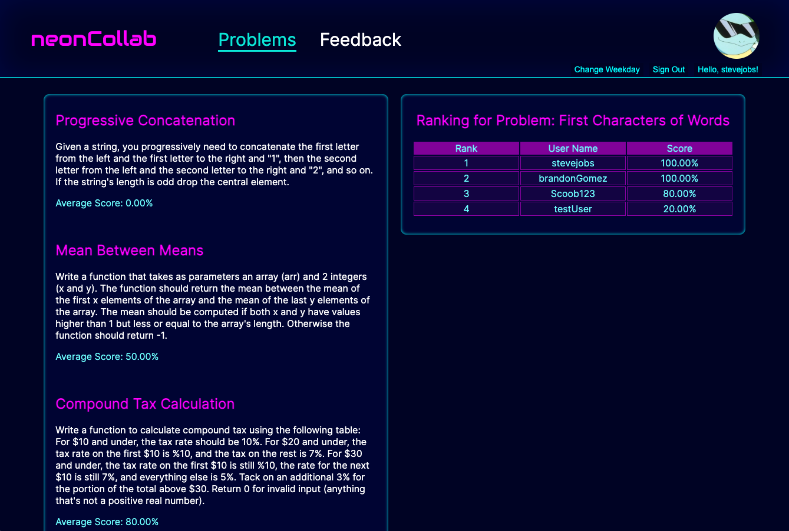

# Neon Collab

Table of Contents
- [Description](#description)
- [Authors](#authors)
- [Built With](#built-with)
- [Getting Started](#getting-started)
- [Project Overview & Demos](#project-overview--demos)
   - [Login Page](#login-page)
   - [Problems Page](#problems-page)
   - [Code Editor Page](#code-editor-page)
   - [Feedback Page](#feedback-page)
   - [Profile Page](#profile-page)

## Description
The dream behind Neon Collab is to create a cyber-punk-themed platform where a community of coders can learn and grow their javascript skills together. 

## Authors

- [**Lauren Laxton**](https://github.com/LLaxt)
- [**Paula Yang**](https://github.com/Paula-Yang)
- [**Brandon Gomez**](https://github.com/bgomez9212)
- [**Eric Chang**](https://github.com/ESC8504)
- [**Patrick Alexandre**](https://github.com/palexandre1)

## Built With

- 
- 
- 
- 
- 
- 
- 
- 
- 
- 
- 
- 

## Getting Started

1. **Clone the repo**
   `git clone https://github.com/Neon-Collab/Neon-Collab`

2. **Navigate to project directory**
   `cd your-project-name`

3. **Install necessary dependencies**
   `npm install`
   `npm run seed`

5. **Update example.config.js and example.env**

6. **Run the application**
   `npm run server-dev`
   `npm run server-dev`

## Project Overview & Demos

## Login Page
The login page utilizes Firebase authentication to create and store account information. New users must choose a unique username, email address, and secure password when creating an account. The custom page graphics are backed by react-particles.

## Problems Page
On Monday to Thursday, users are able to see a list of 4 problems and an overall leaderboard for the past 3 weeks. Users will be able to choose one from four problems each week to practice. When clicking on “select problem”, users are directed to the code editor page. On Friday to Sunday, users can see the average score for each problem of the week, as well as a problem-specific ranking including all the users who completed the same problem. 

## Code Editor Page
Once a coding problem is selected, the user will be directed to a text editor page where they will be able to write and run code. Submissions will be tested in an online execution platform/system, and scores will be stored in the backend.

## Feedback Page
Based on rankings, the users with the highest scores will be paired with users on the opposite end of the rankings. For example with 10 users, 1st will be paired with 10th, 2nd with 9th and so on. Friday mornings users are greeted with a modal asking for a code review with three separate sections (pros, cons, and suggestions) to optimize learning opportunities for the reviewee. Upon submitting the modal a chat will be available for the pair to continue socializing if they choose to do so. The user’s submitted code will also be displayed to compare against the peer review.

## Profile Page
Displays user information, problem history, total number of problems solved, and their global ranking

